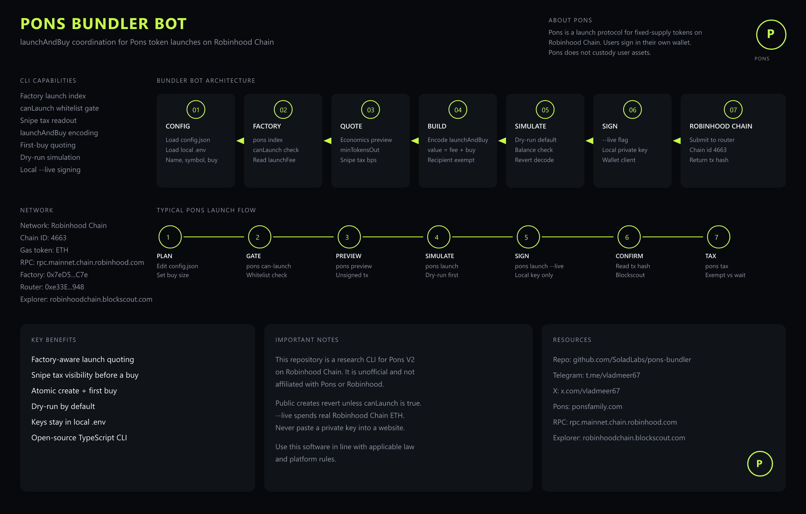

# Pons Bundler

Pons V2 Bundler Bot for Robinhood Chain. This Pons V2 bundler bot indexes Pons factory launches on Robinhood, quotes the Pons snipe tax, and runs a Robinhood Pons launchAndBuy bundler bot on Robinhood. Robinhood Pons bundler bot for Pons token launches on Robinhood Chain. Unofficial Robinhood Pons bundler bot, not affiliated with Pons or Robinhood.

**Repository:** [github.com/SoladLabs/pons-bundler](https://github.com/SoladLabs/pons-bundler)

This project is unofficial and is not affiliated with Pons or Robinhood.

## Overview

Pons V2 applies a decaying snipe tax (`currentSnipeTaxBps`) at the start of a launch. A wallet that is not exempt can pay approximately 99% of spend during the first seconds.

`launchAndBuy` creates the token and executes the first buy in one transaction. The buy recipient is auto-exempt (0 bps). Extra exemption wallets, funding, and same-block orchestration are available via Telegram.

Public creates are gated by `canLaunch(deployer)`. Native launches must send `msg.value = launchFee + quoteIn`.

## Workflow



The CLI walks a launch from local config to Robinhood Chain in seven stages: load `src/config/config.json`, gate the deployer with `canLaunch`, quote fees and `minTokensOut`, encode `launchAndBuy`, simulate, optionally sign with `--live`, then confirm on chain.


| Stage | Module | What happens |
| --- | --- | --- |
| 1. Config | `src/config/config.json`, `.env` | Token metadata, buy size, launcher, recipient |
| 2. Factory | `src/launch.ts` | `pons index`, `canLaunch`, `launchFee` |
| 3. Quote | `src/quoting.ts`, `src/tax.ts` | Economics preview, `minTokensOut`, snipe tax bps |
| 4. Build | `src/launch.ts` | Encode router `launchAndBuy`; `value = launchFee + quoteIn` |
| 5. Simulate | `src/simulate.ts`, `src/dryrun.ts` | Dry-run from the launcher; decode reverts |
| 6. Sign | `src/send.ts` | `--live` signs with `PONSBOT_PRIVATE_KEY` on this machine |
| 7. Chain | Robinhood `4663` | Submit to the router and return the transaction hash |

Typical operator path:


1. Copy [`src/config/config.example.json`](src/config/config.example.json) to `src/config/config.json`, edit it, and fund the launcher.
2. Run `pons can-launch` for the deployer.
3. Run `pons preview` to inspect the unsigned `launchAndBuy`.
4. Run `pons launch` to simulate. Add `--live` only after the dry-run succeeds.
5. After confirmation, run `pons tax --token --wallet` to compare an exempt recipient with a normal wallet.

## Requirements

- Node.js 22 or later
- Robinhood Chain RPC access (public endpoint is used by default)
- A funded deployer that passes `canLaunch` if you intend to broadcast

## Installation

```bash
git clone https://github.com/SoladLabs/pons-bundler.git
cd pons-bundler
yarn install
cp .env.example .env
cp src/config/config.example.json src/config/config.json
yarn test
```

This repository uses Yarn and commits a single `yarn.lock`.

Signing keys stay in the local `.env`. Neither `.env` nor `src/config/config.json` is tracked by git. Do not commit either, and never paste a private key into a website.

## Configuration

Launch parameters live in `src/config/config.json`, copied from [`src/config/config.example.json`](src/config/config.example.json). Replace the placeholder addresses before a live send.

| Field | Description |
| --- | --- |
| `name`, `symbol` | Token metadata |
| `logo`, `description`, `socials` | Optional listing fields |
| `launcher` | Deployer that must pass `canLaunch` |
| `creatorFeeRecipient` | Explicit fee recipient (zero address is rejected) |
| `recipient` | First-buy wallet; auto-exempt from snipe tax |
| `launchConfigId` | Factory launch config index |
| `quoteIn` | First-buy size in wei |
| `slippageBps` | Slippage used when `minTokensOut` is omitted |
| `creatorTaxBps` | Creator tax in basis points |
| `buybackEnabled` | Buyback flag passed to the factory |

Environment variables (see [`.env.example`](.env.example)):

| Variable | Description |
| --- | --- |
| `PONSBOT_RPC_URL` | RPC endpoint (default: `https://rpc.mainnet.chain.robinhood.com`) |
| `PONSBOT_CHAIN_ID` | Chain id (default: `4663`) |
| `PONSBOT_PRIVATE_KEY` | Local signer for `--live` only |

## CLI

```text
pons index
pons can-launch <address>
pons tax --token <address> --wallet <address>
pons preview --config src/config/config.json
pons launch --config src/config/config.json [--live]
```

| Command | Description |
| --- | --- |
| `index` | List enabled factory launch configs |
| `can-launch` | Check whether an address is allowed to create |
| `tax` | Read `currentSnipeTaxBps` and report exempt vs wait |
| `preview` | Encode an unsigned `launchAndBuy` |
| `launch` | Simulate from the launcher; add `--live` to sign locally |

The default mode is simulation. `--live` spends real Robinhood Chain ETH and will revert unless `canLaunch(deployer)` is true.

## Usage

```bash
yarn pons index
yarn pons can-launch 0xYourDeployer

yarn pons tax --token 0xLaunchedToken --wallet 0xExemptRecipient
yarn pons tax --token 0xLaunchedToken --wallet 0xRandomWallet

yarn pons preview --config src/config/config.json
yarn pons launch --config src/config/config.json
```

After a successful launch, the named recipient should read **0 bps**. A wallet that was not the buy recipient typically reads **~9900 bps** until the tax decays (about 3 seconds).

## Project structure

```text
src/cli.ts          Command-line entry point
src/index.ts        Public API barrel
src/addresses.ts    Chain constants and shared types
src/abi.ts          Factory, router, and curve interfaces
src/client.ts       Robinhood Chain RPC client
src/launch.ts       Factory reads and launchAndBuy encoding
src/quoting.ts      Bonding-curve buy quote (pure)
src/tax.ts          currentSnipeTaxBps helper
src/simulate.ts     Transaction simulation and revert decoding
src/dryrun.ts       Dry-run guidance
src/send.ts         Local signing and broadcast
src/validate.ts     Input guards
src/errors.ts       Typed error codes
src/config/         Launch parameters (example is tracked)
tests/              Vitest unit tests
docs/               Workflow diagram
```

## Development

| Script | Purpose |
| --- | --- |
| `yarn pons` | Run the CLI from TypeScript sources |
| `yarn test` | Run the Vitest suite |
| `yarn typecheck` | Type-check without emitting |
| `yarn lint` | Check formatting and lint rules |
| `yarn format` | Apply formatting and safe fixes |
| `yarn build` | Compile to `dist/` |

Lint, typecheck, test, and build run in CI on Node 22 and 24 (see [`.github/workflows/ci.yml`](.github/workflows/ci.yml)).

## Scope

This repository covers factory indexing, tax readout, dry-run, and optional local send.

It does not include extra-wallet generation, funding, fire, or sweep; Telegram automation; hosted signing; or commercial desk presets.

For multi-wallet support, contact [t.me/vladmeer67](https://t.me/vladmeer67).

## License

See [`LICENSE`](LICENSE). This is a research build. Commercial use as a bundler, hosted desk, or Telegram resale requires a paid license.

## Contact

- Telegram: [t.me/vladmeer67](https://t.me/vladmeer67)
- X: [@vladmeer67](https://x.com/vladmeer67)
- Issues: [SoladLabs/pons-bundler](https://github.com/SoladLabs/pons-bundler/issues)
